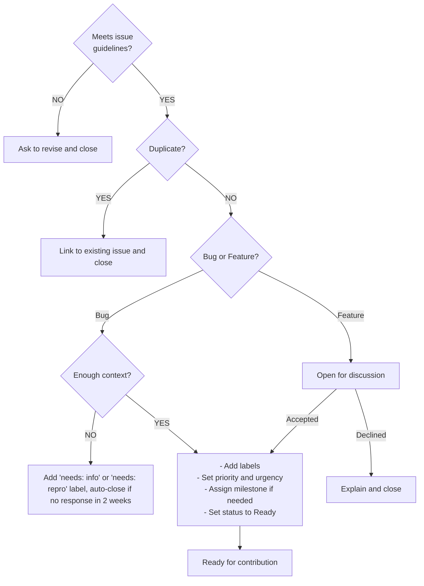
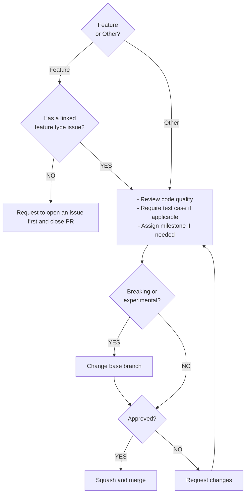

# Contributing to Better Auth

Hi, we really appreciate your interest in contributing to Better Auth. This guide will help you get started. Your contributions make Better Auth even better for everyone. Before you begin, please take a moment to review the following guidelines.

## Repository Setup

1. Fork the repository and clone it locally:

   ```bash
   git clone https://github.com/your-username/better-auth.git
   cd better-auth
   ```

2. Install Node.js (LTS version recommended)

   > **Note**: This project is configured to use
   > [nvm](https://github.com/nvm-sh/nvm) to manage the local Node.js version,
   > as such this is the simplest way to get you up and running.

   Once installed, use:

   ```bash
   nvm install
   nvm use
   ```

   Alternatively, see
   [Node.js installation](https://nodejs.org/en/download) for other supported
   methods.

3. Install [pnpm](https://pnpm.io/)

   > **Note:** This project is configured to manage [pnpm](https://pnpm.io/) via
   > [corepack](https://github.com/nodejs/corepack).
   > Once installed, upon usage you’ll be prompted to install the correct pnpm
   > version

   Alternatively, use `npm` to install it:

   ```bash
   npm install -g pnpm
   ```

4. Install project dependencies:

   ```bash
   pnpm install
   ```

5. Build the project:

   ```bash
   pnpm build
   ```

## Documentation

The documentation site lives in `docs/` and content is organized under `docs/content/docs/` by topic.

To run the docs locally:

```bash
turbo dev --filter docs
```

When making changes to public APIs, please update the relevant documentation.

## Testing

Run the full test suite:

```bash
pnpm test
```

Or filter by file or directory:

```bash
pnpm vitest packages/better-auth/src/plugins/organization --run
```

### Unit Tests

Use `getTestInstance()` from `better-auth/test` to set up test instances:

```typescript
import { getTestInstance } from "better-auth/test";

const { client, auth } = await getTestInstance({
  plugins: [organization()],
});
```

### Database Adapter Tests

Adapter tests require Docker containers. Start them before running adapter tests:

> **Note:** On macOS, the MSSQL container requires Rosetta emulation and at
> least 2 GB of allocated memory.

```bash
docker compose up -d
```

### E2E Tests

End-to-end tests live in `e2e/` and are split into three suites: smoke, adapter,
and integration.

### Regression Tests

When writing a test for a specific GitHub issue, add a `@see` comment:

```typescript
/**
 * @see https://github.com/better-auth/better-auth/issues/1234
 */
it("should handle the previously broken behavior", async () => {
  // ...
});
```

## Issue Guidelines

Before opening an issue, search existing issues to avoid duplicates.
We provide templates to help you get started.

### Bug Reports

Use the [bug report template](https://github.com/better-auth/better-auth/issues/new?template=bug_report.yml).
Provide a clear description of the bug with steps to reproduce and a minimal
reproduction.

### Feature Requests

Use the [feature request template](https://github.com/better-auth/better-auth/issues/new?template=feature_request.yml).
Provide a description of your suggested enhancement, the problem it solves,
and how it would benefit the project.

### Security Reports

Do not open a public issue for security vulnerabilities.
Email [security@better-auth.com](mailto:security@better-auth.com) instead.
See [SECURITY.md](/SECURITY.md) for details.

## Pull Request Guidelines

Check the [Issue Tracker](https://github.com/orgs/better-auth/projects/6) for
issues marked as `Ready`. These have been triaged and are open for contribution.
For new features, please open an issue first to discuss before moving forward.

### Code Formatting and Linting

A pre-commit hook automatically checks and fixes staged files when you commit
using [Biome](https://biomejs.dev/).

### AI Policy

We welcome AI-assisted contributions as long as they solve a real problem.
The code must follow our coding standards and include appropriate tests and
documentation. You should also review and understand your changes well enough
to discuss them with reviewers. PRs that do not meet these guidelines will be closed.

### Submitting a PR

1. Open a pull request against the **`main`** branch.

2. PR titles must follow the [Conventional Commits](https://www.conventionalcommits.org/)
   format, with an optional scope for the affected package or feature:

   - `feat(scope): description` or
   - `fix(scope): description` or
   - `perf: description` or
   - `docs: description` or
   - `chore: description` etc.

   Use `docs` for documentation-only changes.
   Append `!` for breaking changes (e.g. `feat(scope)!: description`).

3. In your PR description:
   - Clearly describe what you changed and why
   - Reference related issues (e.g. "Closes #1234")
   - List any potential breaking changes
   - Add screenshots for UI changes

## Maintenance Guidelines

> This section is for maintainers with commit access, but it's helpful for
> understanding how the project operates.

### Issue Workflow



### Pull Request Workflow



### Release Process

WIP
